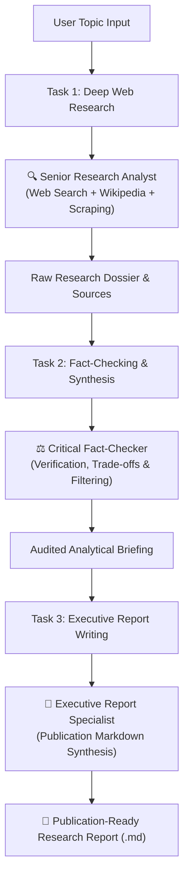

# 🤖 Multi-Agent Research Assistant with CrewAI

An autonomous **Agentic AI** system designed to perform in-depth web research, critical data auditing, and executive-level report writing using **CrewAI**.

---

## 🌟 Architecture & Workflow

The system employs a collaborative multi-agent architecture where agents communicate and pass contextual outputs sequentially:



### 👥 The Autonomous Agents
1. **🔍 Senior Research Analyst**
   - **Role:** Web intelligence, discovery of emerging papers, news, benchmarks, and factual statistics.
   - **Tools:** DuckDuckGo Search (`ddgs`), Wikipedia API, Webpage Scraper, optional Serper Google API.
2. **⚖️ Critical Fact-Checker & Data Synthesizer**
   - **Role:** Audits data, eliminates hallucinations and marketing hype, structures themes, cross-validates citations.
   - **Tools:** DuckDuckGo Search, Webpage Scraper.
3. **📝 Executive Report Specialist**
   - **Role:** Technical writer composing structured Markdown reports containing Executive Summaries, Architecture Deep Dives, Real-World Use Cases, and References.

---

## 🧠 Supported Models Catalog (2026 Ready)

| Provider | Model | Exact CrewAI / LiteLLM `model` string | Context Window | Best Use Case |
| :--- | :--- | :--- | :--- | :--- |
| **Groq** | GPT-OSS 20B | `groq/openai/gpt-oss-20b` | 131,072 | **Fast inference** (~1,000 tok/s): high-volume researcher agents, extraction, concise synthesis |
| **Groq** | GPT-OSS 120B | `groq/openai/gpt-oss-120b` | 131,072 | **Fast + stronger reasoning** (~500 tok/s): tool-using research, coding, mid-tier fact-checker |
| **Groq** | Llama 3.1 8B Instant | `groq/llama-3.1-8b-instant` | 131,072 | **Maximum speed**: routing, query rewriting, metadata extraction, cheap parallel workers |
| **Groq** | Llama 3.3 70B Versatile | `groq/llama-3.3-70b-versatile` | 131,072 | **Fast general intelligence**: research summaries, structured writing, broad agent tasks |
| **Google Gemini** | Gemini 3.8 Flash | `gemini/gemini-3.8-flash` | Account specific | **Fast, agentic engineering**: long-horizon coding, autonomous workflows, strong default researcher |
| **Google Gemini** | Gemini 3.1 Pro Preview | `gemini/gemini-3.1-pro-preview` | Account specific | **Deep reasoning**: difficult planning, complex technical analysis, final synthesis |
| **Google Gemini** | Gemini 3.5 Flash-Lite | `gemini/gemini-3.5-flash-lite` | Account specific | **Lowest-cost fast inference**: repetitive research subtasks, extraction, large fan-out pipelines |
| **Google Gemini** | Gemini 2.5 Pro | `gemini/gemini-2.5-pro` | Account specific | **Deep reasoning + coding**: complex multimodal reasoning and rigorous final-report work |
| **OpenAI** | GPT-5 | `openai/gpt-5` | 400,000 | **Deep reasoning**: planner, fact-checker, coding/research agent, final technical writer |
| **OpenAI** | GPT-5 mini | `openai/gpt-5-mini` | 400,000 | **Fast reasoning**: well-scoped research subtasks, extraction, structured outputs |
| **OpenAI** | GPT-4.1 | `openai/gpt-4.1` | 1,047,576 | **Long-context non-reasoning**: large-document RAG, repository/document analysis |
| **DeepSeek** | DeepSeek V4.1 Flash | `deepseek/deepseek-flash` | 1,000,000 | **Fast, economical long-context agent**: bulk document analysis, web-research workers |
| **DeepSeek** | DeepSeek V4 Pro | `deepseek/deepseek-v4-pro` | 1,000,000 | **Deep reasoning**: final synthesis, complex coding and analysis, high-quality evaluator |

---

## 🛠️ Tech Stack

| Component | Technology | Description |
|---|---|---|
| **Multi-Agent Framework** | `CrewAI 1.15+` | Orchestrates agents, memory, task pipelines, and delegation |
| **LLM Inference** | `LiteLLM`, `Groq`, `Google Gemini`, `OpenAI`, `DeepSeek` | Universal multi-provider support |
| **Search & Retrieval** | `ddgs` (DuckDuckGo), `wikipedia`, `requests`, `bs4` | Zero-API-key live web search and content scraping |
| **Web Dashboard** | `Streamlit` | Interactive UI with Glassmorphism design and live execution tracking |
| **Environment Management** | `python-dotenv` | Secure API key and config management |

---

## 💻 Running the Application

### Option A: Interactive Web UI (Streamlit)
```powershell
cd G:\multi_agent_research_assistant
.\.venv\Scripts\streamlit.exe run app.py
```
- Open browser at `http://localhost:8501`

### Option B: Command-Line Interface (CLI)
```powershell
cd G:\multi_agent_research_assistant
.\.venv\Scripts\python.exe run.py
```
