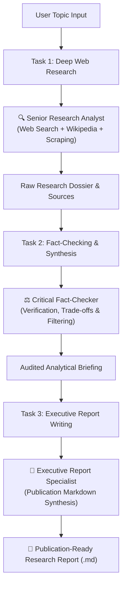

# 🤖 Multi-Agent Research Assistant with CrewAI

An autonomous **Agentic AI** system designed to perform in-depth web research, critical data auditing, and executive-level report writing using **CrewAI**.

---

## 🌟 Architecture & Workflow

The system employs a collaborative multi-agent architecture where agents communicate and pass contextual outputs sequentially:



### 👥 The Autonomous Agents
1. **🔍 Senior Research Analyst**
   - **Role:** Web intelligence, discovery of emerging papers, news, benchmarks, and factual statistics.
   - **Tools:** DuckDuckGo Search (`ddgs`), Wikipedia API, Webpage Scraper, optional Serper Google API.
2. **⚖️ Critical Fact-Checker & Data Synthesizer**
   - **Role:** Audits data, eliminates hallucinations and marketing hype, structures themes, cross-validates citations.
   - **Tools:** DuckDuckGo Search, Webpage Scraper.
3. **📝 Executive Report Specialist**
   - **Role:** Technical writer composing structured Markdown reports containing Executive Summaries, Architecture Deep Dives, Real-World Use Cases, and References.

---

## 🛠️ Tech Stack

| Component | Technology | Description |
|---|---|---|
| **Multi-Agent Framework** | `CrewAI 1.15+` | Orchestrates agents, memory, task pipelines, and delegation |
| **LLM Inference** | `Google Gemini / OpenAI / Groq / Ollama` | Multi-provider support via CrewAI LLM |
| **Search & Retrieval** | `ddgs` (DuckDuckGo), `wikipedia`, `requests`, `bs4` | Zero-API-key live web search and content scraping |
| **Web Dashboard** | `Streamlit` | Interactive UI to configure models, track live research, and download reports |
| **Environment Management** | `python-dotenv` | Secure API key and config management |

---

## 📁 Project Structure

```
multi_agent_research_assistant/
│
├── .venv/                      # Python Virtual Environment
├── .env.example                # Configuration template
├── .env                        # Active API keys
├── requirements.txt            # Pinned dependencies
├── README.md                   # Complete documentation
│
├── run.py                      # Interactive Command-Line Interface (CLI)
├── app.py                      # Streamlit Interactive Web Application
│
├── src/
│   ├── config.py               # Central LLM and provider configurations
│   ├── crew.py                 # Crew assembly and orchestration logic
│   ├── agents/
│   │   └── research_agents.py  # 3 specialized CrewAI Agents
│   ├── tasks/
│   │   └── research_tasks.py   # 3 coordinated sequential Tasks
│   └── tools/
│       └── search_tools.py     # Search, Wikipedia, and Scrape tools
│
└── outputs/                    # Auto-saved Markdown research reports
```

---

## 🚀 Getting Started

### 1. Activate Virtual Environment
Open PowerShell inside the project directory:
```powershell
.\.venv\Scripts\Activate.ps1
```

### 2. Configure API Keys
Edit `.env` and add your preferred LLM key:
```ini
MODEL_NAME=gemini/gemini-2.0-flash
GEMINI_API_KEY=your_gemini_api_key_here

# Or for OpenAI:
# MODEL_NAME=gpt-4o-mini
# OPENAI_API_KEY=your_openai_key_here

# Or for Groq:
# MODEL_NAME=groq/llama-3.3-70b-versatile
# GROQ_API_KEY=your_groq_key_here
```
*(DuckDuckGo and Wikipedia search work out of the box with **no API keys required**!)*

---

## 💻 Running the Application

### Option A: Interactive Web UI (Streamlit)
```powershell
streamlit run app.py
```
- Open browser at `http://localhost:8501`
- Select model, enter topic, and watch the agents collaborate in real-time.
- View and download past reports from the archive tab.

### Option B: Command-Line Interface (CLI)
```powershell
python run.py
```
- Interactive terminal prompt that guides you through topics and outputs directly to the console and `outputs/` folder.
